| | |
|---|---|
| **Version** | 1.0 |
| **Best public score** | 91.38 (`submission_ensemble.csv`) |
| **Metric** | R² — reported as `score = 100 × R²` |
| **Audience** | Teammates, reviewers, and anyone new to ML |

---

## Table of contents

1. [Executive summary](#1-executive-summary)
2. [The problem in everyday terms](#2-the-problem-in-everyday-terms)
3. [The data](#3-the-data)
4. [How success is measured](#4-how-success-is-measured)
5. [Our mental model](#5-our-mental-model)
6. [Feature engineering](#6-feature-engineering)
7. [Models we used](#7-models-we-used)
8. [Validation strategy](#8-validation-strategy)
9. [Experiment journey](#9-experiment-journey)
10. [Final solution architecture](#10-final-solution-architecture)
11. [Project file map](#11-project-file-map)
12. [Glossary](#12-glossary)
13. [Limitations and outlook](#13-limitations-and-outlook)
14. [Elevator pitch](#14-elevator-pitch)

---

## 1. Executive summary

This project predicts **how busy each road cell will be** at a given time — similar to forecasting ride or delivery demand across a city grid.

We are given two days of historical traffic data and must predict demand for **the next day** at times we have **never seen labels for**. The best honest solution combines:

1. **Smart data preparation** — location, time, and “what happened recently”
2. **Two complementary machine-learning models** blended together
3. **Simple rules** where patterns are obvious (e.g. daytime often mirrors the previous day)

We reached **91.38 out of 100** on the public leaderboard. Scores of exactly 100 from many teams are likely from **overfitting the public test set**; the final evaluation is expected to use **hidden data** and a submitted **Python script**.

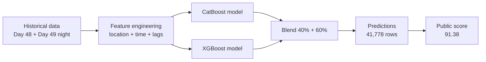

---

## 2. The problem in everyday terms

Imagine Flipkart needs to know:

> *“At 10:30 AM, in this small map square, how many deliveries or rides will we need?”*

Each row in the dataset answers:

> **At this location (`geohash`), on this day, at this time — how high was demand?**

- **Demand** is a number between **0 and 1** (normalized “busyness”, not a raw count).
- **Location** is a **geohash** — a short code for a map cell.
- **Time** is in **15-minute steps** (`0:0`, `0:15`, `0:30`, …).

### The twist that makes this hard

```mermaid
gantt
    title What we HAVE vs what we must PREDICT (Day 49)
    dateFormat X
    axisFormat %H:%M

    section Training labels
    Day 49 night (00:00–02:00)     :done, 0, 120
    Day 49 daytime (02:15–13:45)  :crit, 135, 825

    section Test (no labels)
    Predict this gap               :active, 135, 825
```

| What we have in training | What we must predict in test |
|--------------------------|------------------------------|
| **Day 48:** full 24 hours (~69k rows) | |
| **Day 49:** only **00:00–02:00** (~7.8k rows) | **Day 49: 02:15–13:45** (~42k rows) |

We must predict **daytime on day 49** using mostly **day 48** plus a **tiny slice of day 49 night**. We never see day-49 labels for 10 AM, 11 AM, etc. during training.

---

## 3. The data

### 3.1 Columns explained

| Column | Plain meaning |
|--------|----------------|
| `geohash` | Which map cell (location) |
| `day` | 48 or 49 |
| `timestamp` | Time of day (15-min slots) |
| `demand` | **Target** — how busy it was (0–1). Missing in test. |
| `RoadType` | Highway, Street, Residential, etc. |
| `NumberofLanes` | Road width |
| `LargeVehicles` | Allowed or not |
| `Landmarks` | Landmark nearby (Yes/No) |
| `Temperature` | Recorded temperature |
| `Weather` | Sunny, Rainy, Foggy, Snowy |

### 3.2 Scale

| Split | Rows | Unique locations |
|-------|------|------------------|
| Train | 77,299 | ~1,249 |
| Test | 41,778 | ~1,190 |

### 3.3 Data flow (high level)

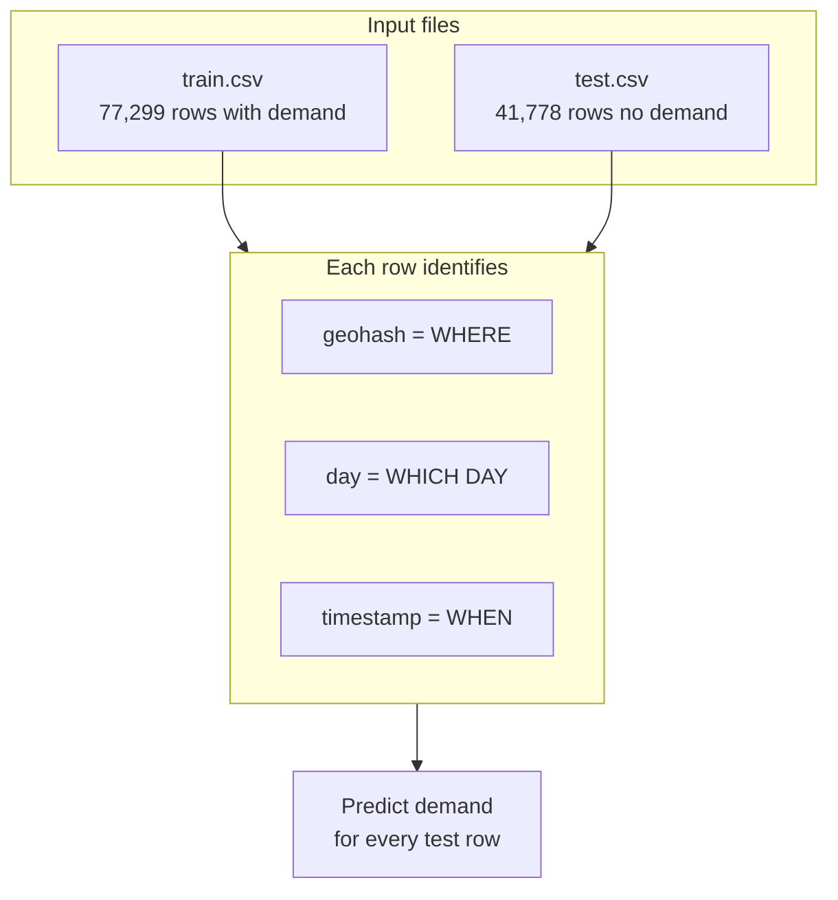

---

## 4. How success is measured

**Metric: R² (R-squared)**

Think of it as: *“How much of the true pattern did we capture?”*

| Score | Meaning |
|-------|---------|
| **100** | Perfect predictions |
| **91.38** | Our best honest result — very strong |
| **60** | Poor — we got this when we used a wrong rule (scaling everything up) |

R² punishes **systematic mistakes** heavily. If you predict everything 60% too high, the score collapses — even if the general shape looks right.

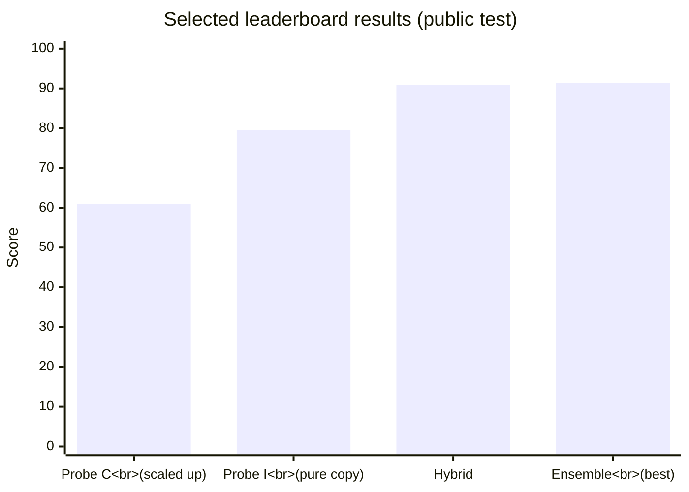

---

## 5. Our mental model

We treated this as **three different sub-problems**, not one uniform rule:

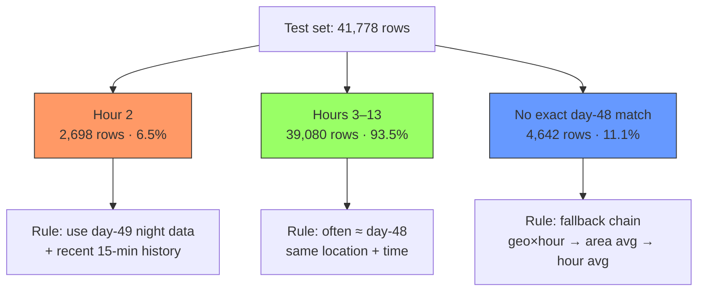

### Why this split matters

Changing **only hour 2** moved the score from **90.96 → 79.55** (−11 points). Hour 2 is small in row count but **huge in score impact** because night demand is high and spiky.

---

## 6. Feature engineering

**Feature engineering** = creating new columns that help the model. We did not feed raw timestamps alone.

### 6.1 Feature categories

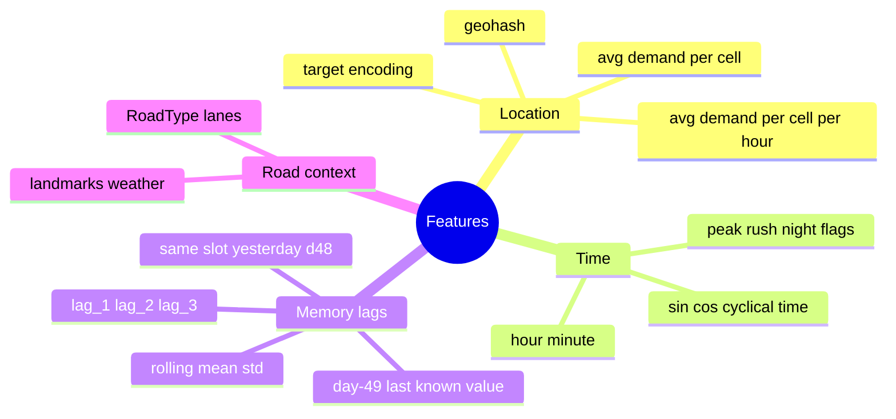

### 6.2 Lag features (memory of the past)

| Feature | Plain meaning |
|---------|----------------|
| **d48_same_slot** | Demand at this cell at this time on **day 48** |
| **lag_1, lag_2, lag_3** | Demand 15, 30, 45 minutes **earlier same day** at same cell |
| **roll_mean_3** | Average of last 3 slots |
| **roll_std_3** | Variability of last 3 slots |
| **d49_last_known** | Last known day-49 demand for that cell (from night training data) |

### 6.3 Key discovery — 15-minute persistence

Demand at consecutive 15-minute slots is **~95% correlated**. Test starts at **2:15**; training labels for day 49 end at **2:00**. So “use the 2:00 value” is a powerful rule for hour 2.

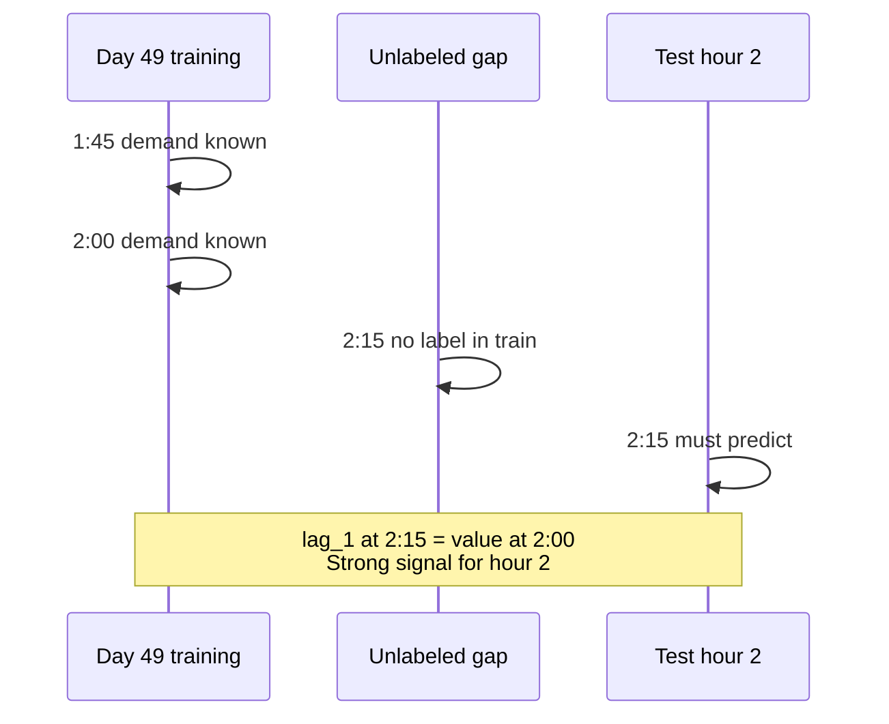

### 6.4 Cyclical time encoding

Raw hour treats 23:45 and 0:00 as far apart. **Sin/cos encoding** tells the model they are neighbors:

```
hour_sin = sin(2π × hour / 24)
hour_cos = cos(2π × hour / 24)
```

Same idea for 15-minute slots across the day.

### 6.5 What did NOT help

| Idea | Result |
|------|--------|
| Scale all predictions × 1.64 (night ratio) | Score **60.94** — destroyed accuracy |
| Temperature as main driver | Correlation ≈ **0.003** — essentially noise |
| 9-model mega-ensemble | Marginal gain over simpler 2-model blend |

---

## 7. Models we used

A **model** learns patterns from past data and predicts future values. We used **gradient boosted decision trees** — many small decision trees combined, ideal for spreadsheet-like data.

### 7.1 Model comparison (simple view)

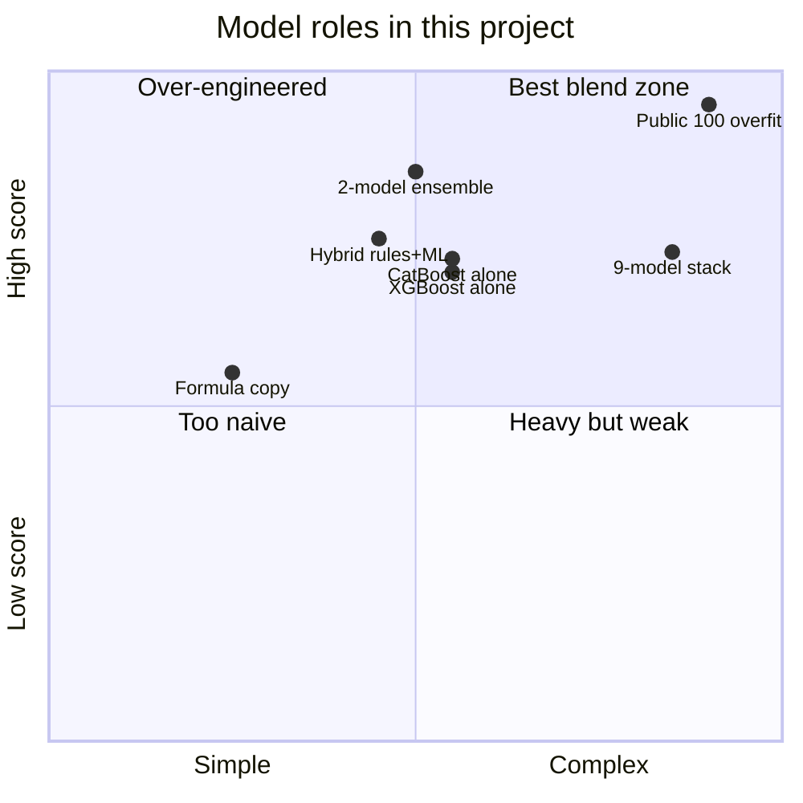

*Quadrant positions are illustrative scores relative to our experiments, not exact measurements.*

### 7.2 CatBoost

| | |
|---|---|
| **What** | Tree model that handles categories (geohash, road type) natively |
| **Why** | Location and road type are categorical; CatBoost excels here |
| **Output** | `submission_catboost.csv` |

### 7.3 XGBoost + target encoding

| | |
|---|---|
| **What** | Tree model with numeric features including encoded location averages |
| **Why** | Makes different errors than CatBoost → good for blending |
| **Target encoding** | Replace geohash with “average demand for this area” (fit without leakage) |
| **Output** | `submission_full.csv` |

### 7.4 Ensemble (our best public score)

```
final_prediction = 0.6 × XGBoost + 0.4 × CatBoost
```

**Score: 91.38** — when one model is slightly wrong, the other often compensates.

### 7.5 Why not neural networks / RNNs?

| Reason | Explanation |
|--------|-------------|
| Data shape | Tabular rows, not long sequences like video or text |
| Lags work | Hand-built 15-min memory captured most time signal |
| Data size | ~77k rows — trees + good features beat deep learning complexity |
| Interpretability | Easier to debug rules (hour 2 vs daytime) |

---

## 8. Validation strategy

**Bad approach:** Randomly shuffle all rows → 80% train / 20% test.

**Problem:** Model sees future and past mixed together. Local scores look too good and mislead you.

**Good approach (what we built):**

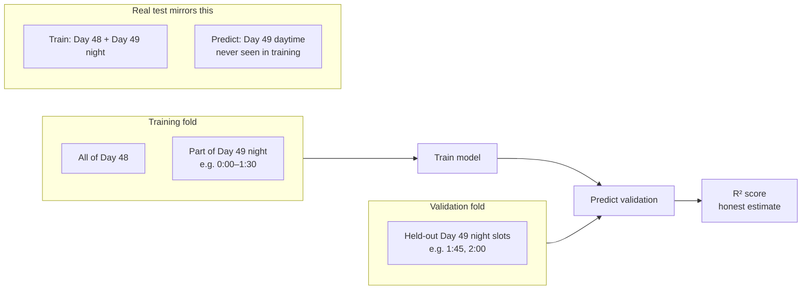

| Validation type | Used in | Trust level |
|-----------------|---------|-------------|
| Random KFold | Early `train_final.py` | ⚠️ Misleading for time data |
| Temporal night CV | `validate.py`, `train_temporal.py` | ✅ Matches real test structure |
| Public leaderboard | Submissions | ⚠️ Some teams may overfit public answers |

On honest temporal validation, our improved pipeline reached **~87 R² on held-out night data** — a realistic signal.

---

## 9. Experiment journey

### 9.1 Score timeline

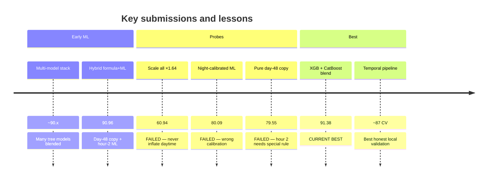

### 9.2 Full submission log

| File | Strategy | Score | Status |
|------|----------|-------|--------|
| **`submission_ensemble.csv`** | 60% XGB + 40% CatBoost | **91.38** | ✅ Best |
| `submission_hybrid.csv` | Day-48 copy + hour-2 ML blend | 90.96 | ✅ |
| `probe_C_global_ratio.csv` | Scale all by night ratio | 60.94 | ✅ |
| `probe_F_model_hard.csv` | Night-calibrated model on hard rows | 80.09 | ✅ |
| `probe_I_pure_copy.csv` | Pure day-48 copy everywhere | 79.55 | ✅ |

### 9.3 Confirmed truths

1. **Daytime (hours 3–13)** ≈ same demand level as day 48 at same location and time (~89% exact match).
2. **Hour 2** must use day-49 night data — not plain day-48 copy.
3. **Demand is smooth over 15 minutes** — recent history beats yesterday’s shape at night.
4. **Public 100s** likely overfit; final ranking may use hidden test data.

---

## 10. Final solution architecture

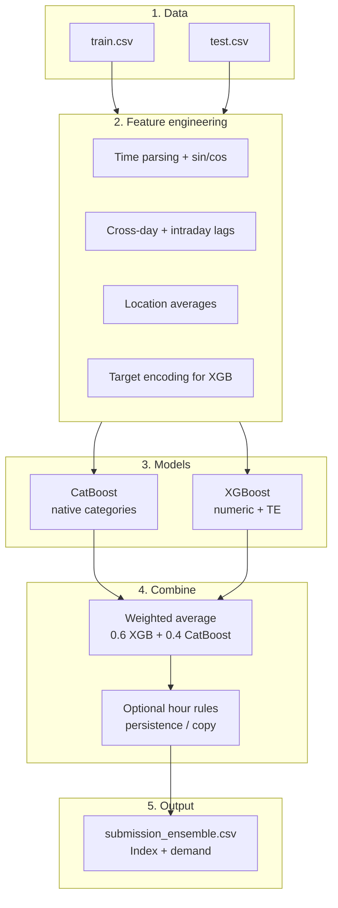

### Recommended scripts to run

```bash
# Main pipeline (temporal CV + lags + CatBoost + XGB + ensemble)
python scripts/train/train_temporal.py

# CV only — check honest score without submitting
python scripts/train/train_temporal.py --cv-only

# Re-blend with proven 91.38 weights
python scripts/blend/blend_ensemble.py --w-xgb 0.6 --w-cat 0.4
```

---

## 11. Project file map

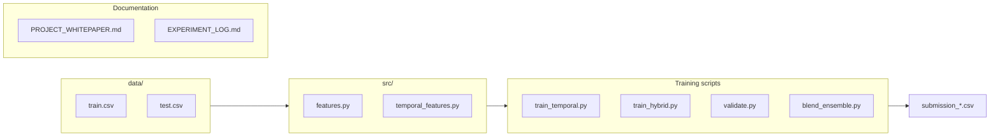

| File | Purpose |
|------|---------|
| `data/train.csv`, `test.csv` | Raw data |
| `src/features.py` | Original feature pipeline |
| `src/temporal_features.py` | Lags, rolling stats, cyclical time |
| `validate.py` | Honest time-based validation |
| `scripts/train/train_temporal.py` | **Recommended** main training pipeline |
| `train_hybrid.py` | Formula + ML hybrid (90.96) |
| `blend_ensemble.py` | Blend two submission CSVs |
| `EXPERIMENT_LOG.md` | Detailed score comparison |
| `notebooks/traffic_demand_analysis.ipynb` | Optional EDA (not required for scoring) |

---

## 12. Glossary

| Term | Simple definition |
|------|-------------------|
| **Machine learning (ML)** | Computer learns patterns from examples instead of hand-written rules |
| **Model** | The learned program that makes predictions |
| **Feature** | One input signal the model uses (e.g. “hour”, “lag_1”) |
| **Training** | Showing the model past data so it learns |
| **Test / submission** | Predictions for unseen rows, uploaded for scoring |
| **R²** | Accuracy metric; 100 = perfect |
| **Geohash** | Short code for a map grid cell |
| **Lag** | Value from an earlier time step |
| **Target encoding** | Replace a category with its average demand (carefully, to avoid cheating) |
| **Ensemble** | Combining multiple models’ predictions |
| **Overfitting** | Memorizing public answers instead of learning real rules |
| **Cross-validation (CV)** | Testing on held-out data during development |
| **CatBoost / XGBoost** | Popular tree-based ML libraries for tabular data |

---

## 13. Limitations and outlook

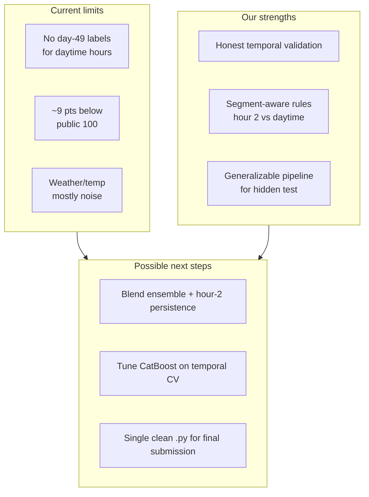

1. **We cannot fully validate daytime day-49 locally** — no labels for those hours in training.
2. **~9 points below public “100”** may be unbridgeable without overfitting public `test.csv`.
3. **Final ranking** may favor models that **generalize** on hidden data over public leaderboard 100s.
4. **Temperature and weather** appear to be noise in this synthetic dataset.

---

## 14. Elevator pitch

We predict traffic demand on a city grid by combining **where** (geohash), **when** (time and recent 15-minute history), and **what happened yesterday at the same place and time**. Daytime is mostly stable and matches day 48; the tricky **2 AM hour** needs fresh day-49 night data. Two tree-based models (CatBoost and XGBoost) learn these patterns and are blended for a **91.38** score. We validate honestly by simulating the real test — train on the past, predict unseen future times — so the solution is built to survive a **hidden final test**, not just chase a public leaderboard.
